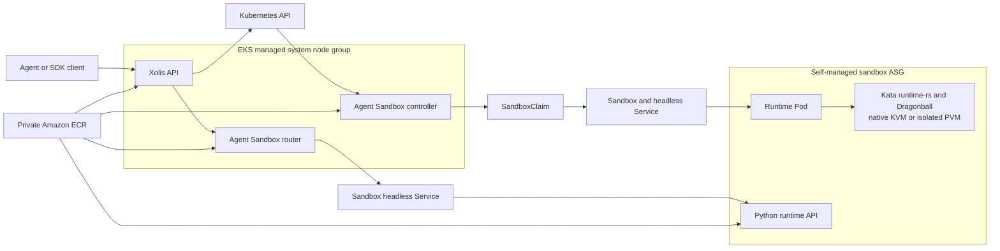

# Initial Sandbox Service Design

## Purpose

This document defines the first service layer built on the validated Xolis AWS
lab. The cluster proves that an EKS self-managed node can run a Kubernetes Pod
through `RuntimeClass/xolis-kata` with Kata Containers 4.0.0, runtime-rs, and
Dragonball.

The implemented milestone is a small, usable service that creates an isolated
Python workspace, waits for it to become ready, runs commands, transfers files,
and removes the workspace at an enforced deadline. It is an architecture and
API validation milestone, not a production multi-tenant service.

This document preserves the initial service contract and records the extensions
that had been validated by `v0.3.0`. It is no longer a list of only future
intent: SSE command streaming, WebSocket/PTTY sessions, optional Nydus profiles,
an isolated PVM runtime path, Hermes bootstrap, and one-replica warm-pool claims
are now implemented and qualified within the small AWS lab boundary.

## Design Decisions

- Use Kubernetes SIG Agent Sandbox as the lifecycle implementation. Do not
  create another Pod lifecycle controller in Xolis.
- Use Agent Sandbox `v0.5.3` and its `v1beta1` APIs as the first pinned
  baseline.
- Use `SandboxTemplate`, `SandboxWarmPool`, and `SandboxClaim`. Configure the
  initial warm pool with zero replicas so a claim takes the controller's cold
  path without paying for an idle Kata VM. The same profile can be scaled to one
  Ready replica for bounded warm-pool operation; both modes are now validated.
- Run all control-plane components on the EKS managed system node group. Only
  sandbox runtime Pods run on the tainted self-managed sandbox nodes.
- Force `runtimeClassName: xolis-kata` in the server-owned template. Clients
  cannot select a runtime class, node, host path, security context, or arbitrary
  Kubernetes Pod specification.
- Use Kubernetes objects as the source of truth. The first service does not
  require PostgreSQL, Redis, or a message queue.
- Use the upstream sandbox router and the runtime HTTP protocol for commands
  and files. The Xolis API remains the authenticated public boundary.
- Keep node capacity management separate from Sandbox lifecycle management.
  During this milestone an operator starts the dedicated sandbox Auto Scaling
  group before serving requests and returns it to zero after the test. Workload
  driven EC2 scaling is deferred.
- Use ordinary OCI images for the default service. Keep Nydus and PVM behind
  explicit, isolated RuntimeClasses and profiles so neither can replace or
  silently receive traffic from the stable OCI/native-KVM path.

## Logical Architecture



The control path creates and observes Kubernetes resources. The data path sends
command and file requests through the router to the stable headless Service
created for the Sandbox. The client never receives Kubernetes credentials or
direct access to a Pod IP.

Use three namespaces in the lab:

- `agent-sandbox-system` for the upstream controller and webhook;
- `xolis-system` for the Xolis API and sandbox router;
- `xolis-sandboxes` for the profile, warm pool, claims, Sandboxes, and runtime
  Pods.

This keeps the API's write permissions namespace-scoped and gives NetworkPolicy
a clear system-to-runtime boundary. Multi-tenant namespace provisioning is
deferred; the lab identifies ownership with labels inside `xolis-sandboxes`.

## Components

### Xolis API

`xolis-api` is the only new service required for the first milestone. Implement
it in Rust with Axum, Tokio, Tower, and kube-rs. The service uses kube-rs to
create and observe Agent Sandbox custom resources and a small HTTP client for
the upstream router/runtime protocol. It does not reimplement the Agent Sandbox
controller.

Responsibilities:

- Authenticate a caller and derive its tenant identity.
- Validate a request against a server-owned sandbox profile.
- Create a `SandboxClaim` with an idempotent name, tenant labels, an absolute
  `shutdownTime`, and `shutdownPolicy: DeleteForeground`.
- Wait for the claim's Ready condition and translate Kubernetes conditions into
  the Xolis status model.
- Proxy command and file operations through the in-cluster sandbox router.
- List, inspect, and terminate only the caller's sandboxes.
- Emit structured audit records with request ID, tenant ID, SandboxClaim UID,
  image digest, resource profile, and lifecycle transitions.

The Deployment starts with one replica, a ClusterIP Service, and access through
`kubectl port-forward`. External ingress and high availability are separate
changes. Its service account receives namespace-scoped permissions for Agent
Sandbox resources and read-only access to their Pods and events; it does not
receive node, Secret, exec, or cluster-administration permissions.

### Agent Sandbox Controller

Install the upstream `sandbox-with-extensions.yaml` release asset pinned to
`v0.5.3`. The controller owns `Sandbox`, `SandboxClaim`, `SandboxTemplate`, and
`SandboxWarmPool` reconciliation. It provides the stable identity, readiness
conditions, TTL enforcement, cold creation, and future warm-pool behavior.

The controller runs only on the managed system node group. Xolis must not fork
its reconciliation logic for the MVP.

### Sandbox Router

Build the upstream Go `sandbox-router-go` from the same Agent Sandbox release
tag and publish it to private ECR. It resolves a Sandbox identity to its live
Pod or headless Service and proxies HTTP and WebSocket traffic.

For the first milestone it is an internal ClusterIP service with one replica.
The Xolis API is its only intended caller. NetworkPolicy should deny direct
access from other namespaces. Use the router's UID-aware Pod cache and request
timeouts, but keep authentication and tenant authorization in `xolis-api`.

### Python Sandbox Runtime

Build `xolis-runtime-python` from the Agent Sandbox Python runtime example at
the same pinned release. The runtime runs as UID 1000 and exposes port 8888 for:

- health and readiness;
- non-interactive command execution;
- ordered SSE command output;
- interactive WebSocket/PTTY sessions;
- file upload and download;
- directory listing and path existence checks.

The writable workspace is `/workspace`; runtime application files remain
read-only. The implementation must confine file APIs to `/workspace`, limit
upload size and command duration, cap captured output, reject path traversal,
and terminate the process group on timeout. The upstream example is a starting
point, not a sufficient security boundary by itself. Kata is the isolation
boundary, while these limits protect service availability and API semantics.

### Sandbox Profile

The first server-owned profile is `python-basic-v1`:

| Setting | Initial value |
| --- | --- |
| Runtime class | `xolis-kata` |
| Runtime image | Private ECR digest for `xolis-runtime-python` |
| CPU request/limit | `250m` / `1` |
| Memory request/limit | `512Mi` / `2Gi` |
| Ephemeral storage limit | `4Gi` |
| Workspace | `emptyDir`, size limit `2Gi` |
| Service port | `8888` |
| Restart policy | `Always`, so a Sandbox can recover after node loss |
| Service account token | Disabled |
| Privilege escalation | Disabled |
| Linux capabilities | Drop all |
| Default TTL | 30 minutes |
| Maximum TTL | 2 hours |
| Network | Controller-managed default deny; DNS only until explicit egress is required |

Use `emptyDir` first so deletion has unambiguous cleanup semantics. Add an EBS
PVC profile only after create, execute, files, TTL, and deletion are reliable.
An EBS-backed profile must use a `WaitForFirstConsumer` gp3 StorageClass and
must account for Availability Zone affinity when a sandbox is resumed.

## External API

The first API is intentionally small:

| Method | Path | Purpose |
| --- | --- | --- |
| `POST` | `/v1/sandboxes` | Create a sandbox from an allow-listed profile. |
| `GET` | `/v1/sandboxes` | List the caller's sandboxes. |
| `GET` | `/v1/sandboxes/{id}` | Return lifecycle state and deadline. |
| `DELETE` | `/v1/sandboxes/{id}` | Terminate and foreground-delete the sandbox. |
| `POST` | `/v1/sandboxes/{id}/commands` | Run one bounded, non-interactive command. |
| `POST` | `/v1/sandboxes/{id}/commands/stream` | Stream bounded command events over SSE. |
| `GET` | `/v1/sandboxes/{id}/sessions` | Upgrade to a bounded interactive WebSocket/PTTY session. |
| `PUT` | `/v1/sandboxes/{id}/files/{path}` | Upload one bounded file. |
| `GET` | `/v1/sandboxes/{id}/files/{path}` | Download a file or list a directory. |

Example creation request:

```json
{
  "profile": "python-basic-v1",
  "ttlSeconds": 1800,
  "metadata": {
    "requestId": "demo-001"
  }
}
```

Return `202 Accepted` with an opaque Xolis ID while the `SandboxClaim` is being
reconciled. Support an `Idempotency-Key` header for create requests. The public
states are `Pending`, `Running`, `Failed`, `Terminating`, and `Expired`; include
the underlying Kubernetes condition reason for diagnostics without exposing the
complete Pod specification.

Interactive terminals and streaming process output were added without widening
the profile boundary: clients still cannot submit arbitrary environment
variables, images, Pod specifications, inbound services, or runtime classes.
Inbound sandbox services and suspend/resume remain outside this API.

## Image Plan

Create private ECR repositories with immutable tags, scan-on-push, lifecycle
policies, and digest-based deployment references:

| Repository | Source | Action |
| --- | --- | --- |
| `xolis/xolis-api` | Xolis Rust source | Build and publish. |
| `xolis/xolis-runtime-python` | Agent Sandbox v0.5.3 runtime example plus Xolis limits | Build and publish. |
| `xolis/sandbox-router` | Agent Sandbox v0.5.3 Go router source | Build and publish. |
| `xolis/agent-sandbox-controller` | `registry.k8s.io/agent-sandbox/agent-sandbox-controller:v0.5.3` | Copy byte-for-byte and record the upstream digest. |

Use mature public ECR images where they fit, but do not treat a public tag as a
release pin:

| Public ECR image | Use |
| --- | --- |
| `public.ecr.aws/docker/library/rust` | Build base for the Xolis API. |
| `public.ecr.aws/docker/library/debian:bookworm-slim` | Minimal runtime base for the dynamically linked Xolis API binary. |
| `public.ecr.aws/docker/library/python:3.14-slim` | Build and runtime base for the Python sandbox. |
| `public.ecr.aws/amazonlinux/amazonlinux:2023-minimal` | Optional generic shell profile after the Python profile passes. |
| `public.ecr.aws/eks/aws-load-balancer-controller` | Optional external ALB ingress in a later milestone. |
| `public.ecr.aws/aws-observability/aws-otel-collector` | Optional logs, metrics, and traces after functional validation. |

Resolve every selected tag to a digest during the implementation and store the
digest in deployment configuration. Mirror critical external images into the
private ECR account so an upstream deletion, registry outage, or mutable tag
cannot break the lab.

Do not use the upstream `latest-main` runtime image as a release dependency. Do
not adopt a third-party all-in-one sandbox image until its source, privilege
model, update policy, and protocol compatibility have been reviewed.

## Security and Resource Policy

- Start with one trusted lab tenant, but put a tenant label on every claim and
  enforce ownership on every API operation.
- Use an allow-listed profile; never accept an arbitrary PodSpec from a client.
- Disable service account token automount in sandbox Pods.
- Deny privileged mode, host namespaces, host paths, host ports, device mounts,
  additional capabilities, and runtime-class overrides.
- Apply the existing sandbox-node selector and taint toleration only through the
  server-owned template.
- Apply default-deny ingress and egress NetworkPolicies. Allow DNS and the
  router-to-runtime path explicitly. Add outbound destinations only as named
  profiles are introduced.
- Override Agent Sandbox's public-internet secure default with a managed
  template policy. The `python-basic-v1` profile permits only DNS egress and
  ingress from the Xolis router.
- Enable the Amazon VPC CNI network-policy controller and node agent in the AWS
  lab. Kubernetes NetworkPolicy objects do not enforce traffic unless the CNI
  implements them.
- Enforce CPU, memory, ephemeral-storage, workspace, command-time, output-size,
  upload-size, and TTL limits.
- Set `shutdownPolicy: DeleteForeground` so callers can observe that the Pod is
  gone before the claim disappears.
- Do not place AWS credentials, Kubernetes credentials, or long-lived API keys
  in the runtime image. Workload identity is a later, explicitly scoped feature.
- Record image digests and Agent Sandbox API versions in every created claim.

Kata isolates the sandbox from the host kernel, but it does not replace API
authorization, network policy, resource quotas, or lifecycle cleanup.

## Failure and Cleanup Semantics

- If claim creation is accepted but readiness times out, preserve diagnostic
  conditions briefly, then foreground-delete the claim and its Sandbox.
- A client retry with the same idempotency key returns the same Xolis ID.
- Deletion is successful only after the `SandboxClaim`, `Sandbox`, Pod, Service,
  and temporary workspace are gone.
- The upstream absolute `shutdownTime` is the backstop when a client or API
  instance disappears.
- If `xolis-api` restarts, it reconstructs state by listing labelled claims; no
  local database recovery is required.
- If no sandbox node is available, the request remains Pending until its
  readiness timeout and is then cleaned up. The API does not scale EC2 capacity
  in this milestone.

## Validation Status

The automated test at `deploy/tests/smoke_service.py` has validated the following
behavior in the AWS lab:

1. Install Agent Sandbox v0.5.3 and the internal router on the system node.
2. Start the dedicated sandbox ASG and wait for a labelled Ready node.
3. Create a `python-basic-v1` claim through the Xolis API.
4. Confirm the resulting Pod uses `runtimeClassName: xolis-kata` and runs on the
   sandbox node.
5. Execute `python -c` and verify stdout, stderr, exit status, and timeout.
6. Upload, list, download, and compare a file inside `/workspace`.
7. Verify path traversal and an oversized upload are rejected.
8. Verify an unapproved egress request is denied.
9. Verify explicit deletion removes all owned resources.
10. Verify the absolute TTL removes an abandoned sandbox.
11. Return the sandbox ASG to zero and confirm no sandbox Pod or PVC remains.

Additional qualification through `v0.3.0` has also:

12. Verified ordered SSE output and WebSocket/PTTY input, output, resize,
    timeout, and cancellation behavior.
13. Verified zero-replica cold claims, one-replica warm claims, replenishment,
    and reset on both the native-KVM and isolated PVM profiles.
14. Verified the PVM profile cannot fall back to native KVM and that a Sandbox
    is recreated after PVM node loss.

## Validated Extensions Through v0.3.0

- `python-nydus-v1` keeps lazy-loaded images opt-in and leaves ordinary OCI as
  the stable fallback.
- `python-pvm-v1` uses the dedicated `xolis-kata-pvm` RuntimeClass, immutable PVM
  AMI, labels, and taints without changing the public lifecycle API.
- The Hermes OCI, Nydus, and PVM profiles validate image startup and CLI
  bootstrap; the demo path can claim a prepared warm sandbox and attach a PTY.
- A five-cold/five-warm PVM comparison on one already-Ready `c7i.xlarge` node
  measured 8.806-second and 1.385-second mean claim-to-Ready times. The test was
  sequential, used a warm node and potentially cached image, and is evidence of
  warm-pool behavior only, not a scale or production-performance claim.

## Deferred Work

- Public ALB or Gateway API exposure, OIDC, quotas, and multi-tenant namespaces.
- Statistically useful cold/warm distributions, concurrency, density,
  cache-miss behavior, and explicit latency targets. The Lab tool and bounded
  PVM samples validate the measurement path but do not establish production
  performance.
- Automatic sandbox-node capacity management.
- Persistent EBS workspaces and filesystem-only suspend/resume.
- Kata VM memory snapshots or runtime-native checkpoint and restore.
- Dragonfly distribution and representative multi-node cache benchmarks.
- Port forwarding and inbound application services.
- Confidential Containers, GPUs, and multi-region operation.
- A separate database, billing ledger, scheduler, or event bus.

## Implemented First Milestone

The first milestone delivered:

1. Private ECR repositories with immutable tags and scan-on-push.
2. A pinned Agent Sandbox v0.5.3 controller and Go router image.
3. A bounded `xolis-runtime-python` command and file API.
4. Version-pinned CRDs, controller installation, and the internal router.
5. The `python-basic-v1` `SandboxTemplate` and zero-replica `SandboxWarmPool`.
6. The asynchronous Rust `xolis-api` with namespace-scoped RBAC.
7. End-to-end lifecycle, isolation, policy, and cleanup validation.

## References

- [Agent Sandbox repository](https://github.com/kubernetes-sigs/agent-sandbox)
- [Agent Sandbox v0.5.3 release](https://github.com/kubernetes-sigs/agent-sandbox/releases/tag/v0.5.3)
- [Agent Sandbox installation](https://github.com/kubernetes-sigs/agent-sandbox#installation)
- [Amazon ECR private registry](https://docs.aws.amazon.com/AmazonECR/latest/userguide/Repositories.html)
- [Amazon ECR image tag immutability](https://docs.aws.amazon.com/AmazonECR/latest/userguide/image-tag-mutability.html)
- [Amazon ECR image scanning](https://docs.aws.amazon.com/AmazonECR/latest/userguide/image-scanning.html)
