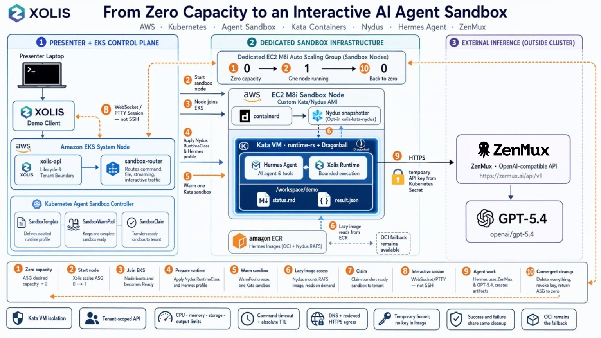

# KubeCon Japan 2026 Hermes Agent Interactive Demo

This directory preserves the Xolis Hermes Agent demonstration prepared for
KubeCon Japan 2026. It contains no model credential or other secret. The helper
script reads a temporary ZenMux key without echoing it and writes the key
directly to a Kubernetes Secret at runtime.

## Contents

- `RUNBOOK.md`: complete presenter workflow, narration, fallback, and cleanup.
- `configure-zenmux-secret.zsh`: hidden-input Secret configuration helper.
- `hermes-temporary-egress.yaml`: temporary public-HTTPS NetworkPolicy used by
  the live demonstration.
- `demo-prompt.txt`: deterministic task pasted into Hermes.
- `architecture.png`: diagram used in the presentation.
- `architecture-image-brief.md`: source brief and prompts used to generate the
  diagram.

This opt-in demo runs Hermes Agent in a dedicated sandbox profile. It does not
change the ordinary `python-basic-v1` profile. The image pins upstream Hermes
Agent commit `846b14ab01a84483d2c3dd429579173040474585` (version 0.19.0 at the
time of evaluation).

Historical immutable references from the 2026-07-28 AWS lab run were:

- OCI: `479874045111.dkr.ecr.ap-northeast-1.amazonaws.com/xolis/xolis-runtime-hermes@sha256:768be3793bc15cd06500890be65beccc76371e12ea03ba5e4e805b3f507accb9`
- Nydus: `479874045111.dkr.ecr.ap-northeast-1.amazonaws.com/xolis/xolis-runtime-hermes@sha256:3171982074bed7c91830958318d5ed41066b7f7b44aeeb1d584a6ae01d676353`
- API: `479874045111.dkr.ecr.ap-northeast-1.amazonaws.com/xolis/xolis-api@sha256:c92e4ad57456b8310722540732f61ba9047d29b525266af16318bec4619db1ae`

The demo AWS environment, ECR repositories, and AMI were deleted after the
event, so these references are retained as evidence and are not expected to
resolve. The Nydus profile was validated on AMI `ami-0ec0906871c3a9d9b`
without model configuration. `hermes --help`, buffered commands, ordered SSE
stdout/stderr, WebSocket/PTTY input and output, file operations, egress denial,
and foreground cleanup passed. This confirms the sandbox and interaction path
only; it does not confirm an inference provider or a credentialed agent task.

## Prepare the Profile

Build and publish the images with `tools/xolis_image_builder.py`. Take the
immutable `xolis-runtime-hermes` and `xolis-runtime-hermes-nydus` references
from its JSON output and render the profiles:

    python3 tools/render_hermes_profile.py \
        --image-reference ACCOUNT.dkr.ecr.ap-northeast-1.amazonaws.com/xolis/xolis-runtime-hermes@sha256:DIGEST \
        > /tmp/hermes-profile.yaml

    python3 tools/render_hermes_profile.py \
        --image-mode nydus \
        --image-reference ACCOUNT.dkr.ecr.ap-northeast-1.amazonaws.com/xolis/xolis-runtime-hermes@sha256:NYDUS_DIGEST \
        > /tmp/hermes-nydus-profile.yaml

Create `Secret/hermes-agent-credentials` in `xolis-sandboxes` with only the
provider variables required for the selected model. Never store that Secret or
its values in this repository. The profile passes the Secret at runtime; the
image contains no credentials.

The checked-in profile permits DNS but intentionally denies external model
traffic. Before a production use, add a reviewed CNI policy that allows TCP 443
only to the selected provider endpoints. The included
`hermes-temporary-egress.yaml` permits public HTTPS for the bounded live demo,
excludes private and special-purpose ranges, and must be deleted immediately
afterward. Then apply the rendered profile and configure `xolis-api` to use
`XOLIS_PROFILE=hermes-agent-v1`, `XOLIS_WARM_POOL=hermes-agent-v1-pool`, and a
command timeout of at least 900 seconds. For Nydus, use
`hermes-agent-nydus-v1`, `hermes-agent-nydus-v1-pool`, and install the opt-in
`xolis-kata-nydus` RuntimeClass before applying the profile.

## Run the Demo

The repository demo tool performs the profile setup, warmup, sandbox creation,
and interactive terminal attachment in one command:

    python3 tools/hermes_demo.py \
        --egress-manifest /path/to/reviewed-provider-egress.yaml

For the Nydus image path, add `--image-mode nydus`. The included egress manifest
records the conference configuration; review it against the provider and the
cluster's CNI behavior before reuse. Omitting it is useful for validating that
Hermes starts, but model calls remain blocked by the profile's DNS-only policy.
The tool does not create, inspect, or print model credentials; it requires the
existing `hermes-agent-credentials` Secret.

The default cleanup deletes the sandbox, scales its warm pool to zero, and
restores the previous `xolis-api` environment. Add `--keep-prepared` when
several consecutive demos should share the warmed environment.

For a custom OpenAI-compatible model service, place `OPENAI_API_KEY` and
`CUSTOM_BASE_URL` in the runtime Secret and add both
`--hermes-provider custom` and `--hermes-model PROVIDER/MODEL` to the demo
command. This supplies the model selection to the fresh Hermes process without
persisting endpoint configuration in the ephemeral workspace.

For a manual client, create a sandbox, connect to
`/v1/sandboxes/{id}/sessions` with the tenant header, and send this first
WebSocket message:

    {"type":"start","command":"hermes","ttl_seconds":900,"rows":30,"columns":120}

Send terminal keystrokes as base64-encoded `input` messages and render decoded
`output` messages. Use `resize`, `cancel`, and `close` as documented in the
runtime README.

Give Hermes this deterministic task:

> In `/workspace/demo`, create `status.md` with a short English summary of this
> sandbox session and create `result.json` containing the keys `agent`,
> `task`, and `completed`. Set `agent` to `hermes`, `task` to
> `interactive-sandbox-demo`, and `completed` to `true`. Do not read or print
> environment variables or credentials. Finally, display both files.

After the run, download and inspect both artifacts through the file API. Close
the WebSocket and delete the sandbox. Confirm that no command remains running
and that the sandbox claim is deleted. The demo is a correctness demonstration,
not a performance result.

In the bounded 2026-07-28 comparison, the Nydus image pull took 0.585 seconds
and the OCI pull took 4.696 seconds, while end-to-end Ready took 16.601 seconds
for Nydus and 10.415 seconds for OCI. There was one sample per mode and Nydus
ran first. Treat these numbers as diagnostic evidence, not a performance claim.
